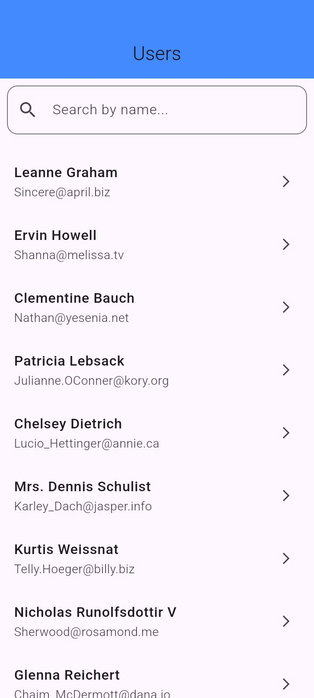
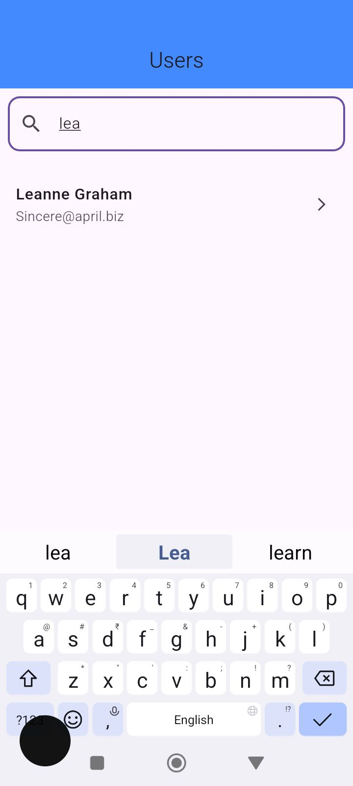
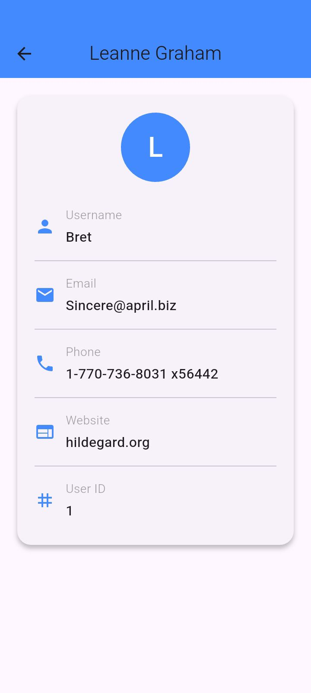

# Flutter User App

A simple Flutter application that fetches user data from a public API and displays it in a clean list view.
The app is built using **BLoC (flutter_bloc)** for state management and demonstrates API integration, error handling, pull-to-refresh, and search functionality.

---

## 📱 Features

* Fetches users from [JSONPlaceholder API](https://jsonplaceholder.typicode.com/users)
* Displays name and email in a list
* Pull-to-refresh to reload data
* Error handling with messages
* Search users by name (real-time filtering)

---

## 🚀 Getting Started

### Prerequisites

* Install [Flutter SDK](https://docs.flutter.dev/get-started/install) (latest stable version recommended)
* Install [Android Studio](https://developer.android.com/studio) or [Xcode](https://developer.apple.com/xcode/) (for emulator/simulator)
* Make sure you have an Android/iOS device or emulator running

### Installation

1. Clone the repository:

   ```bash
   git clone https://github.com/techie-ashish1924/Assignment-FLUTTER-USERLIST.git
   cd Assignment-FLUTTER-USERLIST
   ```

2. Get dependencies:

   ```bash
   flutter pub get
   ```

3. Run the app:

   ```bash
   flutter run
   ```

---

## ⚙️ Dependencies

* [flutter_bloc](https://pub.dev/packages/flutter_bloc) — State management
* [http](https://pub.dev/packages/http) — API calls


---

## 📝 Assumptions & Decisions

* Used **BLoC** for clear separation of UI and business logic.
* Stored the original user list internally in the BLoC to allow real-time filtering for search.
* Search functionality is case-insensitive and filters by **name** only.
* Simple UI focusing on functionality rather than heavy design.

---

## 📸 Screenshots

(Add your screenshots here)

| Home Screen                          | Search Example                           | Detail Screen (Bonus)                    |
| ------------------------------------ | ---------------------------------------- | ---------------------------------------- |
|  |  |  |

---

## 👨‍💻 Author

* Your Name
* GitHub: [@techie-ashish1924](https://github.com/techie-ashish1924)

---
